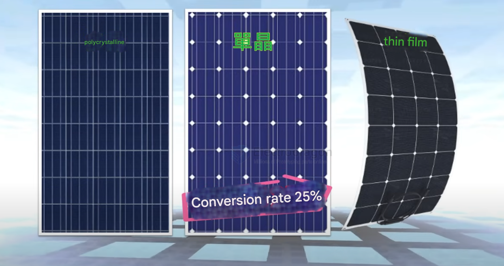
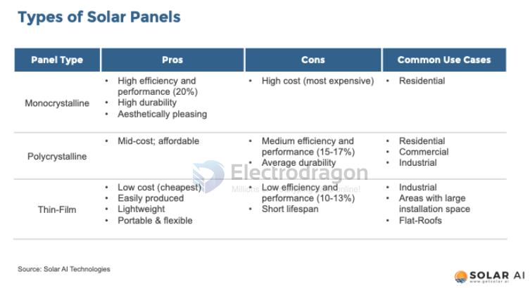
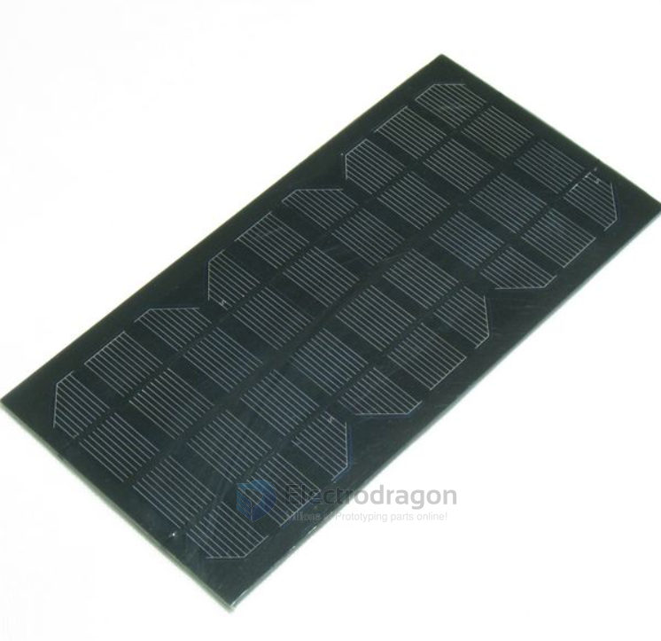
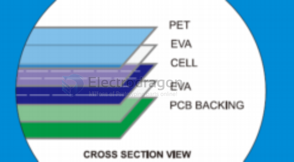
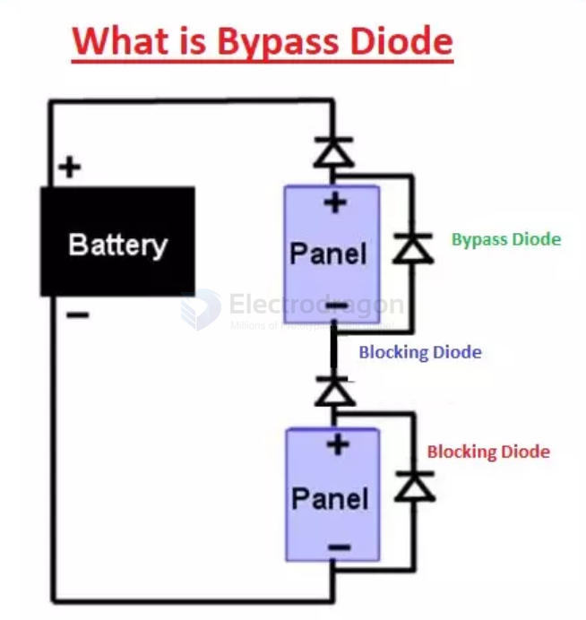

# solar-panel-dat

- [[OPS1009-dat]]

#### 1. Solar Panels

Solar panels are the heart of your system, capturing sunlight to generate electricity.

| Feature                   | Monocrystalline Silicon Panels                  | Polycrystalline Silicon Panels               | Thin-Film Solar Panels                            |
| :------------------------ | :---------------------------------------------- | :------------------------------------------- | :------------------------------------------------ |
| **Material**              | High-purity single crystalline silicon          | Multiple silicon crystals                    | Often non-silicon materials                       |
| **Appearance**            | Uniform dark appearance                         | Uneven surface color                         | Varies, can be flexible                           |
| **Conversion Efficiency** | High (often >25%)                               | Moderate (~15%)                              | Moderate (~15%)                                   |
| **Manufacturing Cost**    | Relatively high                                 | Lower                                        | Varies, can be cost-effective for specific uses   |
| **Key Characteristics**   | Highest efficiency, market mainstream           | Lower cost, being phased out                 | Thin, flexible, lightweight                       |
| **Common Uses**           | Residential, commercial, high-performance needs | Older systems, budget-conscious applications | Windows, mobile power, campers, portable chargers |

*   **Types:**
    *   **Monocrystalline Silicon Panels:** Made from high-purity single crystalline silicon, offering high conversion efficiency (often >25%) and a uniform dark appearance. They are currently a market mainstream, though manufacturing costs can be higher. (See more at [[solar-panel-dat]] )
    *   **Polycrystalline Silicon Panels:** Made from multiple silicon crystals. They have a less uniform surface color and a slightly lower conversion efficiency (around 15%) but are generally less expensive. An example is the R3 polycrystalline silicon solar panel ( [[OPS1009-DAT]] ).
    *   **Thin-Film Solar Panels:** Often made from non-silicon materials, with conversion efficiency around 15%. They are significantly thinner, flexible, and suitable for applications like windows, mobile power supplies, and camper exteriors.
*   **Packaging:** Common packaging types include PET Laminated and Epoxy Resin Laminated panels. PET lamination offers good sunlight absorption while being lightweight, suitable for outdoor solar gadgets. Epoxy covered boards offer great stiffness and are good for outdoor environments. (Details at [[solar-panel-dat]] and [[OPS1009-DAT]] ).
*   **Voltage:** Common specifications are 12V and 24V.
    *   For systems generating < 1 kWh, 12V panels are recommended.
    *   For systems generating > 2 kWh, 24V panels are recommended.
*   **Wattage (W):** Indicates the panel's power output. Common sizes include 50W, 100W, 200W, and 300W. A 12V 100W panel can generate about 5-6 amps per hour.
*   **Diodes:** Bypass diodes are used in solar panels to prevent "hot-spots" caused by shaded or underperforming cells, allowing electricity to flow around them and protecting the panel. Direction protection diodes can also be used in the power supply. (See [[solar-panel-dat]]) and [[solar-power-dat]] ).

## Common solar panel types 

There are 3 main types of solar panels available in the solar market today. They’re 
- monocrystalline, 
- polycrystalline and 
- thin-film solar panels. 

## Common Packaging Types 

Types of Commercial Solar Panels and their structures 
- PET Laminated Solar Panel 
- Epoxy Resin Laminated Solar panel 
- Standard Glass Laminated Solar panel 
- Frameless Glass Laminated Solar panel 
- Back-contact semi-flexible Solar panel 
- Thin film glass laminated Solar panel 
- Polycrystalline silicon solar cell

## PET Laminated Solar panel

### MATERIALS

PET (also known as Polyethylene terephalate) is a type of plastic which is commonly used for bottled water, takeaway containers and household products due to their material stability, wear resistant and non-toxic nature. It’s high transparency and good scratch resistant also makes it suitable as a protective layer above the solar cell. Solar cells used can be monocrystalline or polycrystalline.

This allows good sunlight absorption while keeping the solar panel lightweight (compared to glass laminated solar panels)

### PROCESS:

The PET laminated solar panel is made by placing layers of PET, EVA, solar cell and PCB together. They are then laminated by machine at a temperature of 135 degrees Celcius which will melt the encapsulating materials together to form a watertight bond.

#### HIGHLIGHTS:

High clarity
UV resistant
Humidity resistant
Good scratch resistant
Consistent textured surface
Attractive appearance

### APPLICATIONS:

It is widely used on small plug-n-play outdoor solar LED lights, folding solar chargers, solar backpacks and other solar gadgets. It is usually used for low voltage and low power applications.

LIFESPAN: 3 year +

## Panel Wiring 

Diodes in solar panels help prevent "hot-spots." 

Hot-spots are areas on the panel that can overheat and get damaged. 

This can happen when some solar cells are shaded or not working properly, causing a reverse flow of electricity and power loss. 

To prevent this, bypass diodes are used. These diodes allow the electricity to flow around the underperforming cells, protecting the panel. Typically, one bypass diode is used for every twenty solar cells.

## ref 

- [[solar-panel]]