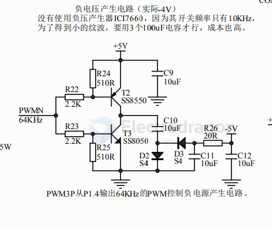

# voltage-dat

- [[circuits-dat]] - [[VIN-dat]] - [[VBUS-dat]] - [[VBAT-dat]] 

- [[power-dat]] - [[Vref-dat]] - [[voltage-dat]]

- [[VRMS-dat]] - [[voltage-dat]]

- [[voltage-dat]] - [[voltage-interverter-dat]] - [[voltage-divider-dat]] - [[voltage-reference-dat]] 

- [[voltage-level-dat]]

- [[voltage-low-alarm-dat]] - [[voltage-dat]]

## voltage negative 

- [[oscilloscope-dat]]

- [[ICI7660-dat]]

## speed control - 2. Voltage Speed Control (Changing the Input DC Voltage)

Directly changes the terminal voltage $U$ applied across the DC motor.

* **Principle:** The speed equation of a DC motor is:
  
  $$n = \frac{U - IR}{K\Phi}$$
  
  With a fixed field flux, the speed $n$ is approximately proportional to the terminal voltage $U$. Higher voltage → faster speed; lower voltage → slower speed.

* **Implementation Methods:**
  * **Adjustable regulated supply / DC-DC buck module:** Turn a potentiometer knob to change the output voltage.
  * **Series resistor (old, outdated method):** A variable resistor is placed in series to divide the voltage, but the resistor heats up and wastes a lot of energy — extremely inefficient and now largely obsolete.

## ref 

