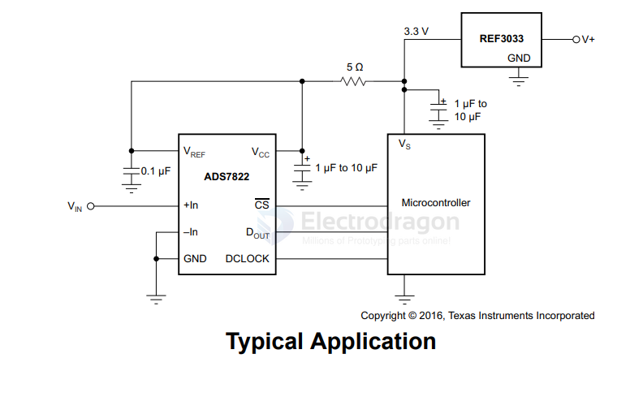
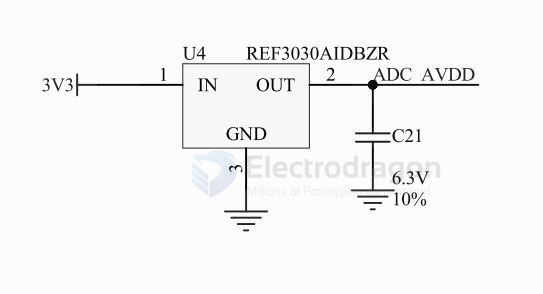

# voltage-reference-dat

- [[supervisory-dat]] - [[power-switch-dat]] - [[voltage-reference-dat]] - [[voltage-interverter-dat]] - [[power-detector-dat]] - [[power-amplifier-dat]]

- [[voltage-dat]]

== V_ref 

- [[voltage-reference-dat]] - [[TI-voltage-reference-dat]] - [[TI-dat]]

- [[sensor-dc-voltage-dat]]

## REF30

REF30E and REF30, Low Current Voltage Reference in SOT-23-3

Output voltage options
- REF30E: 1.25V to 5V
- REF30: 1.25V to 4.096V

- [[ADC-dat]]

for ADC-AVDD 

- [[peripherals-dat]]

- REF3025AIDBZR
- TL431

## TL431

## voltage reference 

- ADR435BRZ - Ultralow Noise XFET Voltage References with Current Sink and Source Capability

- [[TL431-dat]] - [[voltage-reference-dat]]

- [[supervisory-dat]]

| Feature                  | Voltage Reference         | Supervisory IC                     |
| ------------------------ | ------------------------- | ---------------------------------- |
| Purpose                  | Provide precise voltage   | Monitor power & generate reset     |
| Output type              | Analog voltage            | Digital reset                      |
| Accuracy                 | Very high (ppm/°C)        | Moderate (1–3%)                    |
| Noise                    | Very low                  | Not relevant                       |
| Used in                  | Analog precision circuits | MCU, CPU, digital systems          |
| Extra functions          | None                      | Watchdog, manual reset, sequencing |
| Affects system start-up? | No                        | Yes                                |

## more 

`MCP1525` / `MCP1541` - 2.5V and 4.096V Voltage References - The Microchip Technology Inc. MCP1525/41 devices are 2.5V and 4.096V precision voltage references that use a combination of an advanced CMOS circuit design and EPROM trimming to provide an initial tolerance of ±1% (max.) and temperature stability of ±50 ppm/°C (max.). 

`LM336Z`-2.5/LFT3 - Voltage References Voltage reference diode 3-TO-92

The LM136-2.5-N/LM236-2.5-N  and LM336-2.5-Nintegrated circuits are precision 2.5V shunt regulatordiodes. 

These monolithic IC voltage references operate as a low-temperature-coefficient 2.5V zener with 0.2Q dynamic impedance. 

A third terminal on the LM136-2.5-N allows the reference voltage and temperature coefficient to be trimmed easily.

- Voltage References | LM336Z25 - 2.49 V, 2% Programmable Shunt Regulator

ADM708SARZ

ADR01/ADR02/ADR03/ADR06 - Ultracompact, Precision 10.0 V/5.0 V/2.5 V/3.0 V Voltage References

- [[TI-sensor-dat]]

## ref 

- [[tech-dat]] 

- [[voltage-reference]]

- [[power-dat]]

