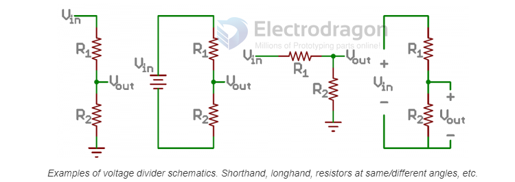
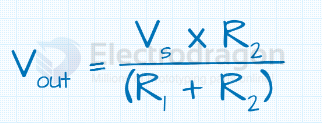
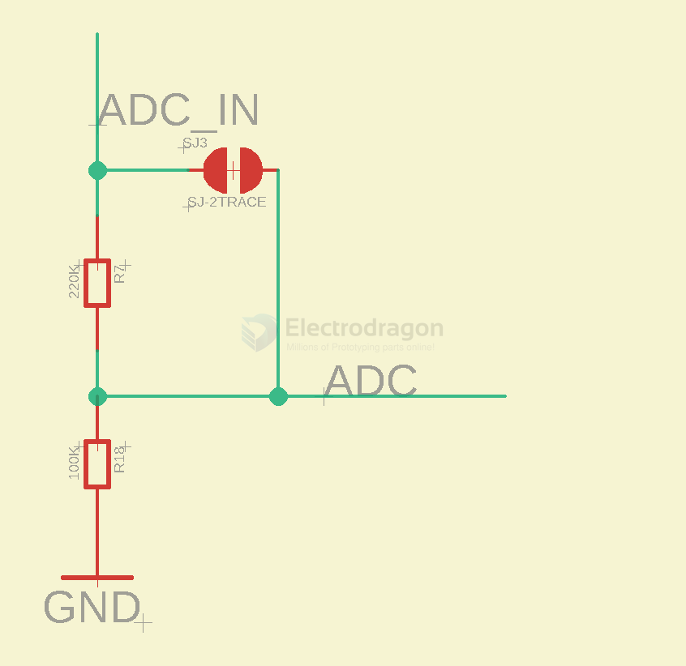

# voltage-divider-dat

## applications 

- [[button-dat]] - [[ADC-bat-monitor-dat]]

## how works 

== voltage ladder 

Vout = Vin * (R2 / (R1 + R2))

    4.77V = 18V * (13K / (13K + 36K) ) 
    3.65V = 18V * (13K / (13K + 51K) ) 

    0.877V = 5V * (47K / (47K + 10K) )
    0.526V = 3V * (47K / (47K + 10K) )

    0.952V = 5V * (51K / (51K + 12K) )
    0.571V = 3V * (51K / (51K + 12K) )

Vin == Vout * (R1 + R2) / R2

    == 1V * (220K + 100K) / 100K
    == 3.2V

A voltage divider circuit is a very common circuit that takes a higher voltage and converts it to a lower one by using a pair of resistors. The formula for calculating the output voltage is based on Ohms Law and is shown below.

where:

- VS is the source voltage, measured in volts (V),
- R1 is the resistance of the 1st resistor, measured in Ohms (Ω).
- R2 is the resistance of the 2nd resistor, measured in Ohms (Ω).
- Vout is the output voltage, measured in volts (V),

## [[NWI1118-dat]] on board ADC voltage ladder 

cut off SJ3 first to use the ADC ladder. 

- [[ESP8266-dat]]

## ref 

- https://learn.sparkfun.com/tutorials/voltage-dividers/all#:~:text=A%20voltage%20divider%20is%20a,most%20fundamental%20circuits%20in%20electronics.

https://ohmslawcalculator.com/voltage-divider-calculator

- [[ESP32-ADC-dat]]
