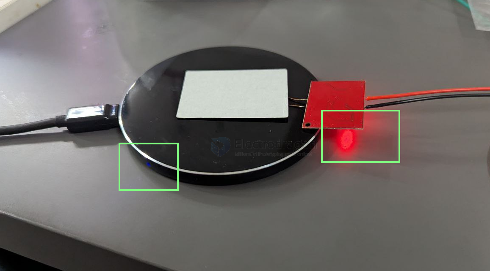
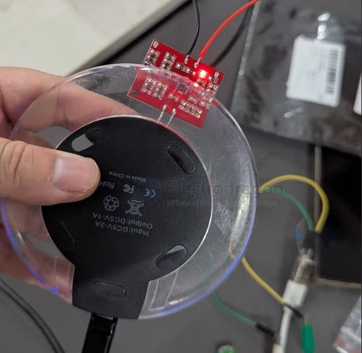
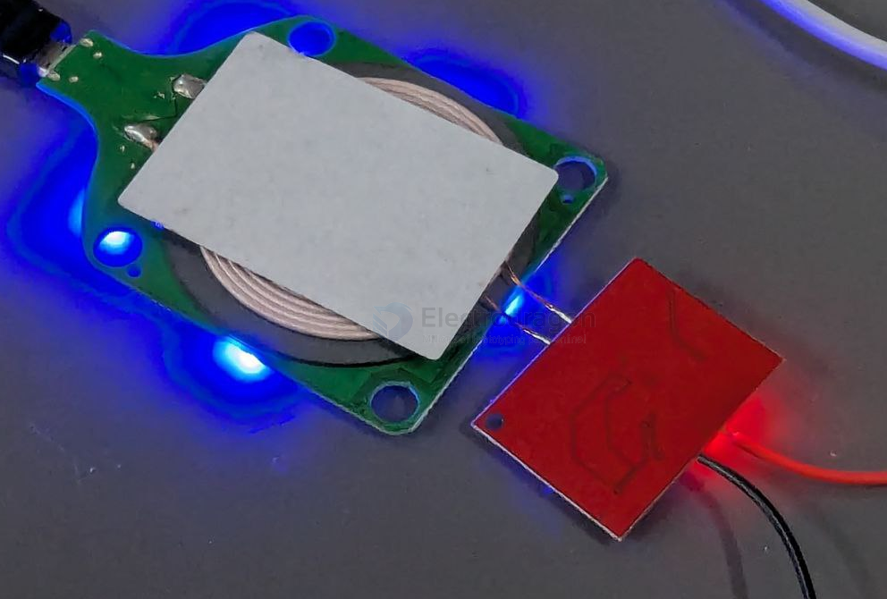

# wireless-charge-dat

- [[OPM1167-dat]] - [[OPM1168-dat]]

- [[BQ51013-dat]] - [[BQ51050-dat]] - [[TI-power-dat]]

## standards 

- [[QI-dat]] - [[QI-wireless-charge-dat]]

- [[WPC-1.2-dat]] 

- [[fast-charge-methods-dat]]

## transmitter 

## ref 

- [[USB-dat]]

- [[wireless-charge]]