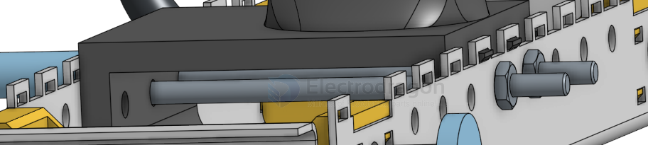

# assembly-dat

## assembly-screw 

- 多个定位孔之间的余量设计

## assembly-real

- [[plastic-dat]] connection 

- [[asm-plastic-Snap-fit-dat]] - [[plastic-dat]]

- [[screw-Self-tapping-dat]] - [[plastic-dat]] - [[screw-dat]]

long through thread 

## assembly-CAD

fastened
revolute 
slider mate 

planar mate

Allow translation along the X and Y axes, and rotation about the Z axis. 

The lst selection serves as the movement point, and the 2nd as the stationary point.

Cylindrical mate 
Pin slot mate
Ball mate 
Parallel mate 

## ref 

- [[product-dat]]