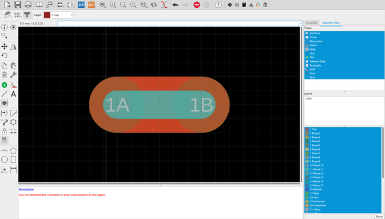

# eagle-CAD-dat

- https://github.com/Edragon/Eagle-CAD-dat
- ~~https://github.com/Edragon/CAD-Eagle-part~~

## Tips 

### oval, or oblong shapes

Unfortunately there is still no option for creating a plated slot in the library editor with the ease you can an SMD or PAD. However, you can do as @millingm suggested or the variation I prefer which is a PAD on each end of the slot and then draw each of the inner/outer layer pad areas with a polygon on each of the 16 routing layers. The also draw the slot as a line on the Milling layer. You end up with something like this in your library:

And when it is in the board you end up with:

https://forums.autodesk.com/t5/eagle-forum/slotted-pads/td-p/7487203

## ref 

- [[eagle-cad]]