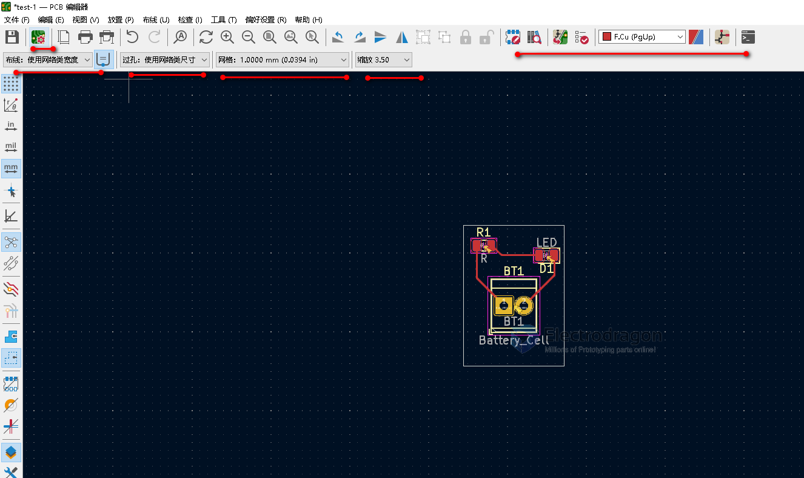

# kicad work flow 

- prerequisite shortcuts - https://docs.kicad.org/7.0/en/kicad/kicad.html

- add symbols and assign footprint 
  - enter "E" for properties, and assign the footprint 

## PCB 

commom layers 

| layers         | explain | CN     |
| -------------- | ------- | ------ |
| edge.cuts      |         | 边框层 |
| F/B Silkscreen |         | 丝印层 |
| F/B Mask       |         | 阻焊层 |
| F/B Paste      |         | 锡膏层 |
| F/B Cu         |         | 铜箔层 |

* F for front and B for back 

### PCB init setup 

- 网络线宽
- 钻孔尺寸
- 网格 1.0 mm 
- 缩放 

