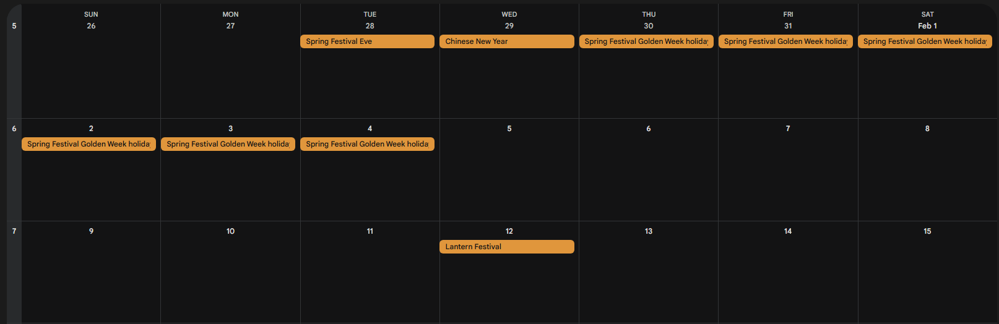
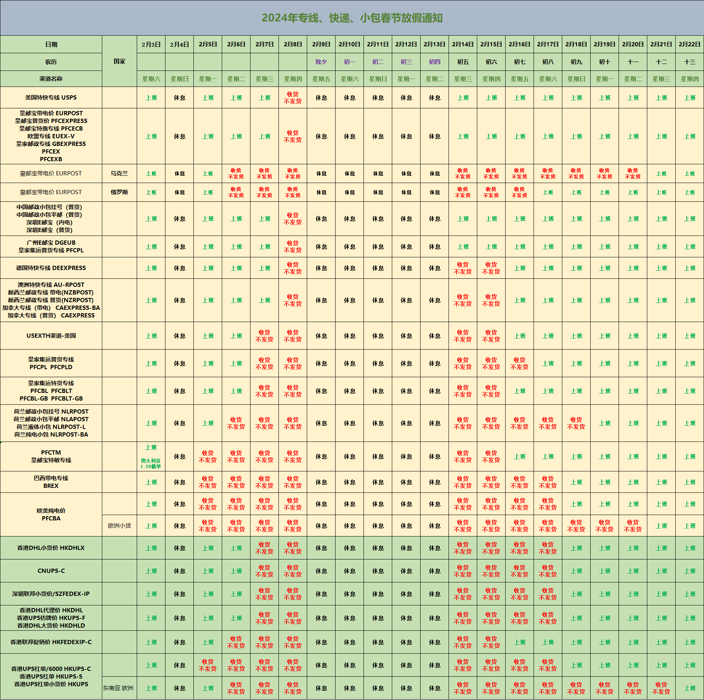

# chinese holiday 

Chinese Spring Festival holiday will influence at least 4 weeks, 2.5 weeks beforehand, and 1.5 weeks afterhand. 

## 2025 

## Chinese new year holiday 2025

| The schedule          |      | date |
| --------------------- | ---- | ---- |
| Production Halt       | Jan. | 21   |
| Shipment End          | Jan. | 25   |
| The holiday Start     | Jan. | 29   |
| The holiday End       | Feb. | 4    |
| Shipment start        | Feb. | 6    |
| Product Fully Recover | Feb. | 12   |

## 2025 holiday overview 

| Type                 | duration | 2025             | 2024         |
| -------------------- | -------- | ---------------- | ------------ |
| New year             | 3        | Jan. 30 ~ Jan. 1 | Jan. 30 ~ 1  |
| Chinese new yar      | 20       | Jan. 29 ~ Feb. 4 | Feb. 10 ~ 17 |
| Ching Ming Festival  | 3        | Apr. 4           | Apr. 4 ~ 6   |
| Labor holiday        | 5        | May. 1 ~ 3       | May. 1 ~ 5   |
| Dragon Boat Festival | 3        | Jun. 20          | Jun. 8 ~ 10  |
| Mid-Autumn Festival  | 3        | Oco. 1 ~ 7       | Sep. 15 ~ 17 |
| National Day         | 7        | Oco. 1 ~ 7       | Oco. 1 ~ 7   |

## The end time of the shipment Example 2024

