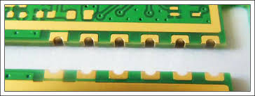

# Penalization 

## methods 

#### Castellated holes

Castellated holes, please make sure your board are designed correctly: Place holes, add V-cuts, etc

# penalization-dat

## ref

- [[stamp-holes-dat]]

- [[拼板]]

## obseleted 

* [http://dl.electrodragon.com/k/index.php?share/file&user=1&sid=wsIZnGKW 1. Eagle penalize and export gerber file]
* [http://dl.electrodragon.com/k/index.php?share/file&user=1&sid=eKTRh7b3 2. detailed panelized tutorial]
