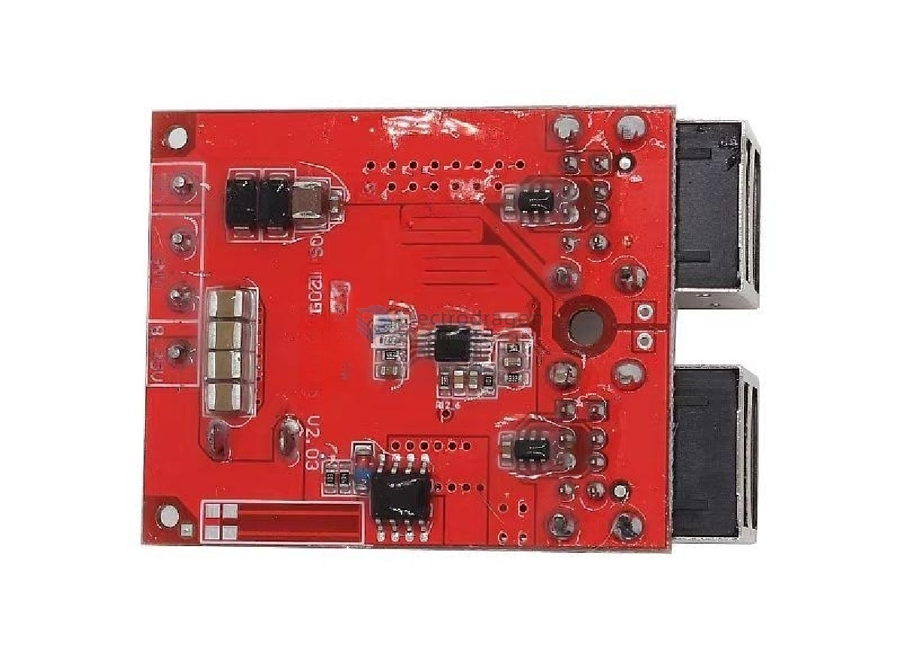

# PCB-Adhesive-dat

- waterproof
- moisture-proof
- dust-proof

"Three-proofing adhesive" is a type of glue designed to offer waterproof, dustproof, and corrosion-resistant protection. It's commonly used for electronic devices and circuit boards, helping them stay safe and stable in harsh environments.

