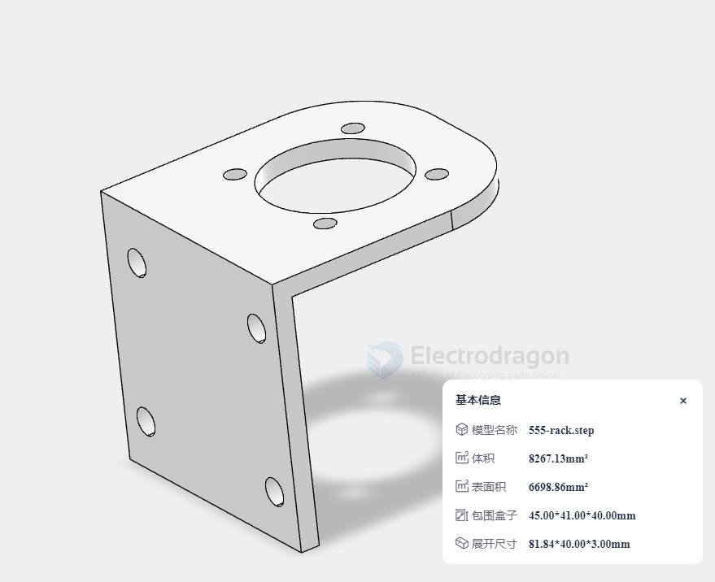

# sheet-metal-fab-dat

- Supported 3D (required) formats: .step, .stp; Supported 2D formats: dwg, dxf, pdf; Compressed packages (zip, rar) can be uploaded directly.
- Supports unified ordering for multiple parts in a compressed package; file names for 2D files, BOM lists, etc., need to be consistent (number of files per upload ≤20, individual file size <100M).
- If there are assembly relationships between parts, it is strongly recommended that you upload an assembly STEP file.

## Examples Stainless Steel 201

- the following bending rack price == 20RM == 3 USD 

## Example Plastic PP PE Sheet 

unit == mm, color == black

## ref 

- [[CAD-dat]]