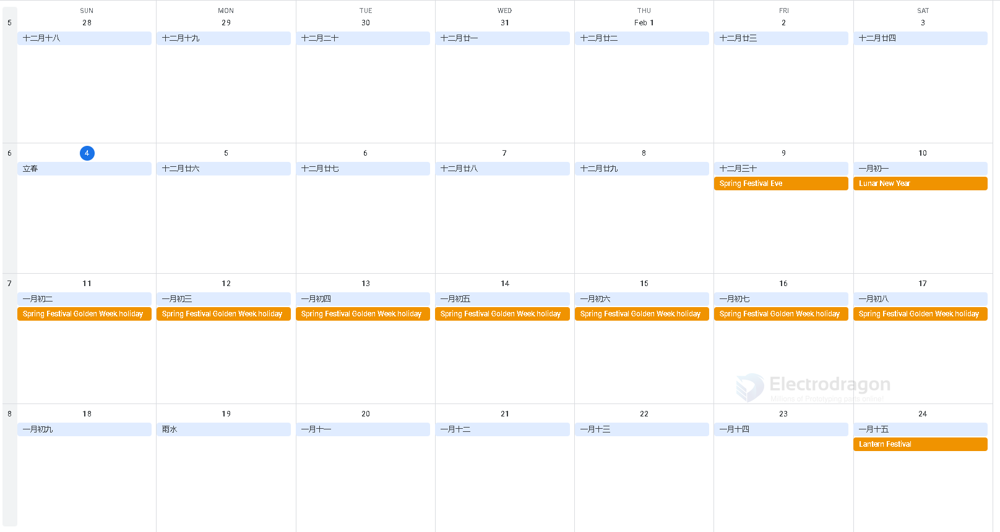
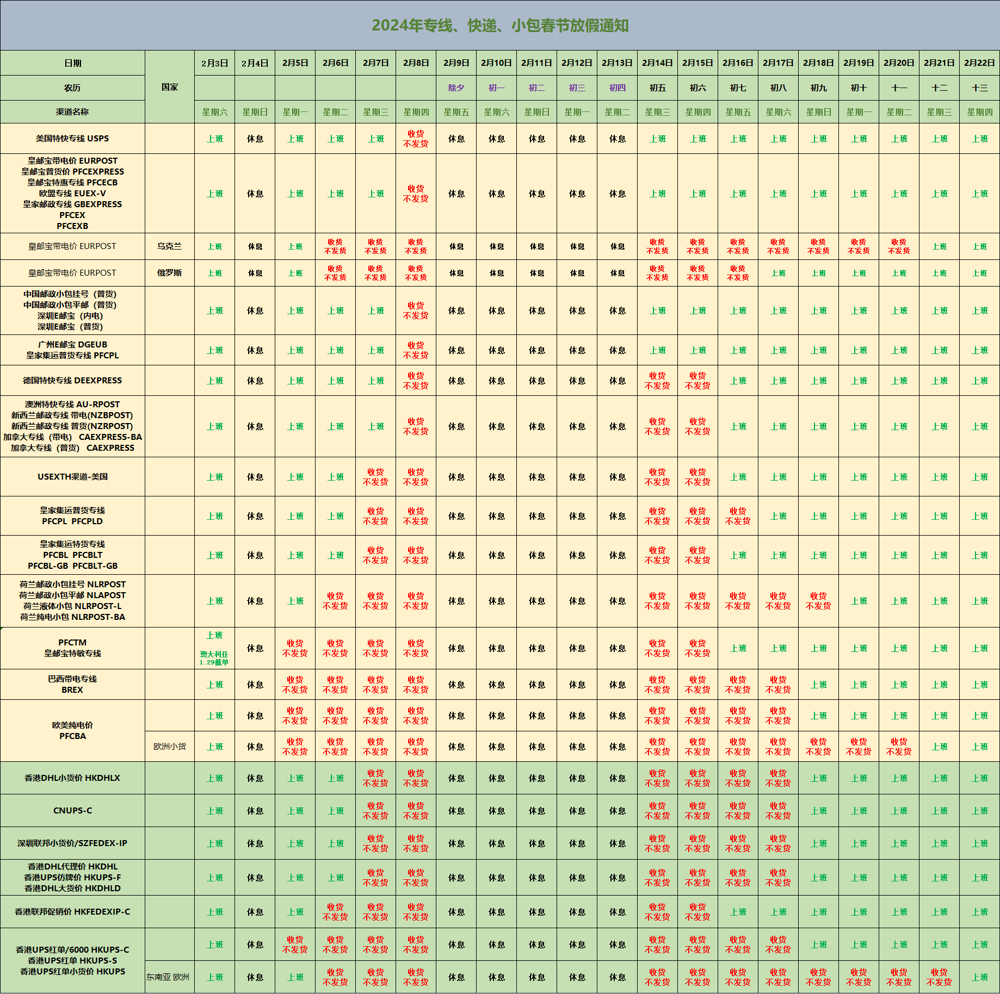

# chinese holiday 

Chinese Spring Festival holiday will influence at least 4 weeks, 2.5 weeks beforehand, and 1.5 weeks afterhand. 

## 2024 holiday overview 

| Type                 | Date              |
| -------------------- | ----------------- |
| New year             | 30 ~ 1 Jan.       |
| Chinese new yar      | 10 ~ 17th Feb.    |
| Ching Ming Festival  | 4 ~ 6 April       |
| Labor holiday        | 1 ~ 4 May         |
| Dragon Boat Festival | 8 ~ 10 June       |
| Mid-Autumn Festival  | 15 ~ 17 September |
| National Day         | 1 ~ 10 Ocotober   |

### 2024 Chinese new year holiday

Please see an example below for 2024: 

| The schedule             | date      | Note                         |
| ------------------------ | --------- | ---------------------------- |
| some extreme people end  | 26th Jan. | enclosure case manufacturers |
| the most people end      | 2-4th     | most suppliers               |
| we end                   | 5th       | our shipment stop            |
| the holiday start        | 8th       |                              |
| the holiday end          | 17th      |                              |
| we start                 | 18th      | our shipment start           |
| the extreme people start | 24-25th   |                              |

Before the holiday 
- the actual holiday start from 9th 
- BUT most chinese people / workers travel back from 2th early in case, because all we have to travel from one provice to another, probably thousands kilometers
- Our enclosure manfacturer close work at 26th January, earliest
- We stop shipment from 5th 2024

Back from the holiday 
- We back to work on 17th
- most suppliers could be later 19th~21th (初十 - 初十二)

the end time of the shipment 
