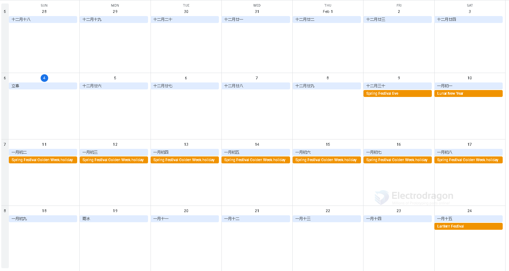

# chinese holiday 

Chinese Spring Festival holiday will influence at least 4 weeks, 2.5 weeks beforehand, and 1.5 weeks afterhand. 

Please see an example below for 2024: 

- the actual holiday start from 9th 
- BUT most chinese people / workers travel back from 2th early in case, because all we have to travel from one provice to another, probably thousands kilometers
- Our enclosure manfacturer close work at 26th January, earliest
- We stop shipment from 5th 2024
- We back to work on 17th, but our suppliers could be later 19th~21th

