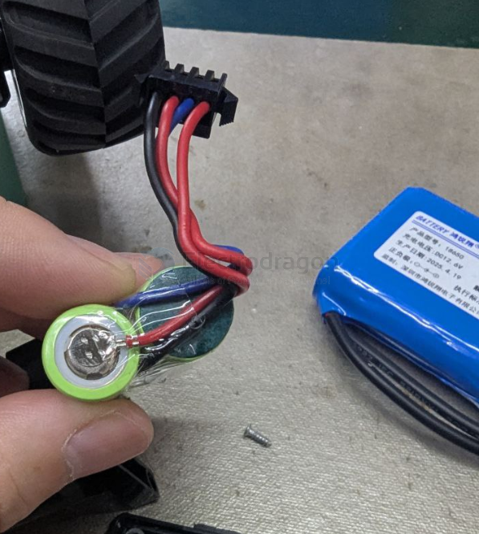
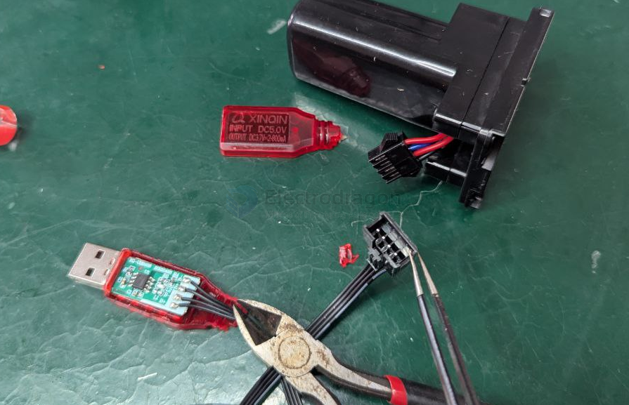
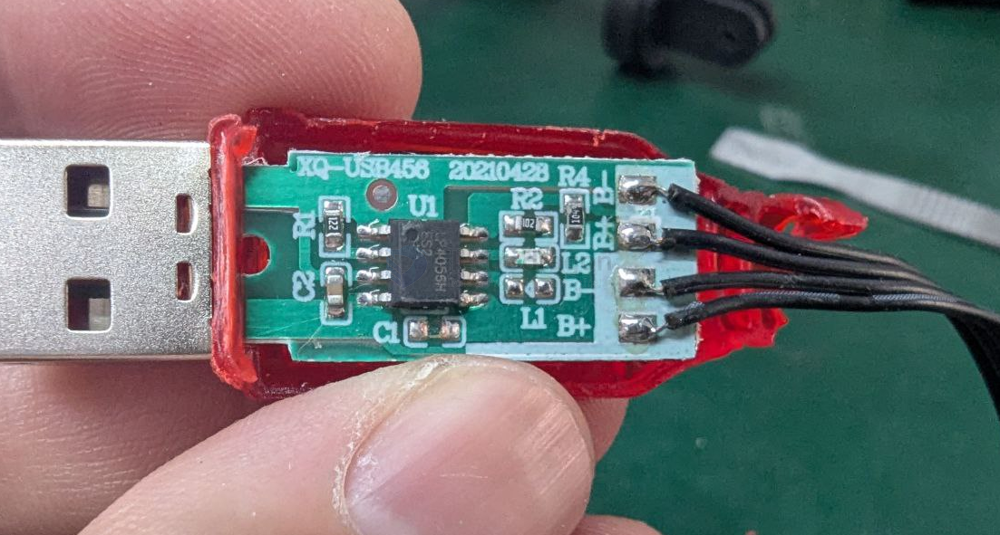

# 2S-lithium-battery-charger-dat

## Method 1. 

How to use single [[TP4056-dat]] to charge 2S lithium battery pack?

The battery should be built with all pins out: 

parallel charging by [[TP4056-dat]] directly 

Board looks like: 

## Method 2.

If building your own charger or pack, include a BMS, and use a charger with current limit and CV/CC behavior.

如果你自己DIY电池组或充电系统，务必使用保护板（BMS），并选择支持恒流恒压输出的充电器。

## IF the 2S pack battery does NOT have the BMS board 

These chargers are designed to charge 2S packs with balanced charging and proper voltage/current control.

🔧 Example:

IMAX B6 or similar smart chargers

Connect via the main power plug and balance plug (JST-XH, for example)

## IF the 2S pack battery has the BMS board 

== BMS (Battery Management System) + DC Power Supply

- need 2S BMS == 2S 锂电池保护板（BMS）

Example setup:

Use an 8.4V Li-ion charger (e.g., 8.4V/1A wall charger)

The BMS will:

- Protect against overcharge
- Balance the cells (if it's a balancing BMS)

## ref 

- [[battery-dat]]