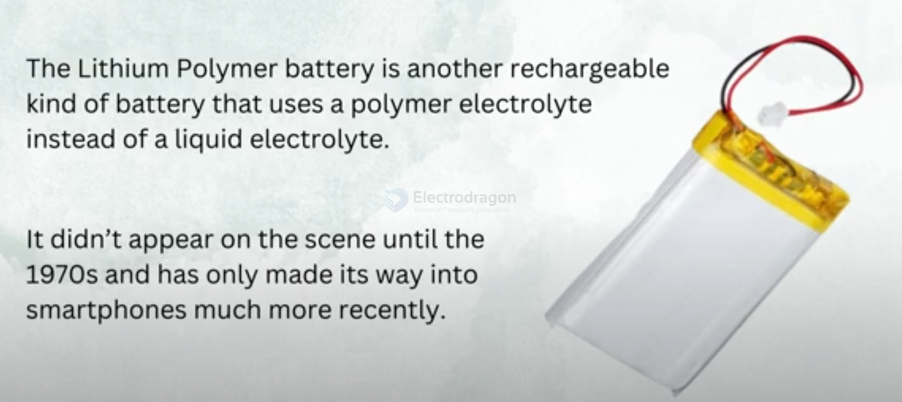
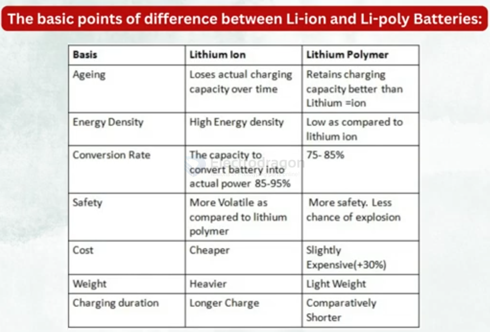

# Li-Po-battery-dat

- ExtremelySafe
- Light-weighted
- Versatileinnature
- Low self-discharge level
- Thin with huge capacity

## Lithium Polymer Batteries

### Overview
Lithium Polymer batteries use a polymer electrolyte instead of a liquid electrolyte, making them more efficient and safer. This technology appeared in the 1970s and has recently been adopted in smartphones. LiPo batteries are versatile and available in various shapes and sizes.

### Merits
1. **Extremely Safe**: LiPo batteries have flexible aluminum packaging that protects them from explosions or hazardous situations.
2. **Lightweight**: They are highly portable due to the absence of heavy metals or liquid electrolytes.
3. **Versatile**: LiPo batteries can be customized into different shapes and sizes, offering flexibility in design.
4. **Low Self-Discharge**: They have a low self-discharge rate, meaning they retain charge well when not in use.
5. **High Capacity**: Despite being thin (even below one millimeter), LiPo batteries have high capacities and are 10 to 15% stronger than other batteries of the same size.

### Demerits

1. **High Cost**: LiPo batteries are more expensive compared to other battery types of the same size and specifications.
2. **Lower Energy Density**: They are less efficient in terms of energy density and have fewer charge cycles compared to Li-Ion batteries.
3. **Shorter Lifespan**: The decay cycle of LiPo batteries is shorter, making them less long-lasting than Li-Ion batteries.

## Compare 

## Li-ion VS Li-Poly Battery 

| Feature               | **Li-ion Battery**                                       | **Li-Poly Battery**                                      |
|-----------------------|----------------------------------------------------------|----------------------------------------------------------|
| **Electrolyte**        | Liquid or gel electrolyte. Requires a hard casing to contain the liquid. Can be more volatile and prone to leakage if damaged. | Solid or gel-like polymer electrolyte. More stable, flexible, and less prone to leakage. |
| **Shape/Size**         | Typically **cylindrical** or **prismatic** in rigid, metal casings. Bulkier design, limiting shape flexibility. | Can be made in **custom shapes** and **sizes**, including thinner, flat, or flexible designs, allowing for more space-efficient configurations. |
| **Weight/Size**        | **Heavier** due to metal casing. Bulkier, typically used for larger devices. | **Lighter** and **more compact** due to the flexible polymer casing, ideal for small, thin devices like smartphones and wearables. |
| **Energy Density**     | Generally **higher energy density**, meaning more power for the same weight and volume. This gives longer battery life in large devices. | **Lower energy density** than Li-ion batteries, meaning slightly shorter battery life per charge, but improvements in technology can minimize this difference. |
| **Durability/Safety**  | **Less durable**; susceptible to damage, leakage, or fire if punctured or overcharged. Requires more protective circuitry to prevent overheating and short circuits. | **More durable and safer**; less prone to leakage, rupture, or combustion. It has a lower risk of damage, making it safer in small, thin devices. |
| **Charging Speed**     | Can **charge faster** due to higher energy density, and faster charging systems are more commonly available. | **Slower charging speed** compared to Li-ion due to higher resistance in the polymer electrolyte, though the difference can be minor depending on the device. |
| **Lifespan**           | Typically lasts **longer** (500-1000 charge cycles), especially for larger applications like laptops, power tools, and electric vehicles. | **Shorter lifespan** (300-500 cycles) compared to Li-ion, though this may be less of an issue in smaller devices or low-drain applications. |
| **Applications**       | Commonly used in **larger, power-demanding devices** such as laptops, electric vehicles, and power tools where higher energy density is a priority. | More often used in **smaller, portable electronics** like smartphones, drones, wearables, and tablets, where compact size and flexibility are important. |
| **Cost**               | **More cost-effective** per unit of energy and storage, especially in larger battery configurations. | **Slightly more expensive** to manufacture due to the polymer design and materials used. |
| **Performance in Extreme Temperatures** | Li-ion batteries generally have a **wider operating temperature range**, but may degrade faster in high or low temperatures. | Li-Poly batteries are more **sensitive to extreme temperatures**, potentially leading to quicker degradation in high heat or low cold, though this can depend on the specific chemistry used. |
| **Environmental Impact** | **Higher environmental impact** due to the complexity of materials and disposal, though efforts are being made for recycling improvements. | Typically **lower environmental impact**, with polymer materials that can be easier to recycle than the metals used in Li-ion batteries. However, both types still have significant environmental concerns. |
