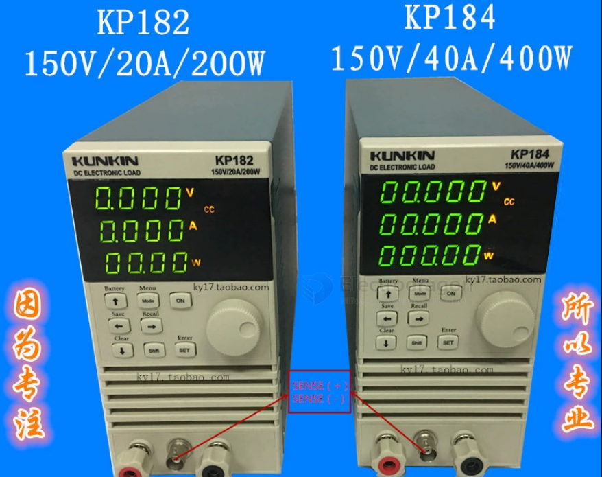

# KP182-dat

## KP182（200W/150V/20A） 不带通讯

CC/CV/CR/CP four modes, battery capacity, internal resistance test, overcurrent, comparison, dynamic test, 4-digit display

CC/CV/CR/CP four modes, battery capacity, internal resistance test, overcurrent, comparison, dynamic test

RS232/RS485 communication, enhanced host computer software, 220V/110V power supply switching, 5-digit display

## Product Overview:

KP182/4 series electronic loads can be widely used in LED lighting, power supplies, chargers, batteries, and other industries for product testing and aging. Its current mode can be used to simulate a resistive load to discharge batteries and load power supplies; its voltage mode can be used to simulate a capacitive load for chargers and can simulate the constant voltage characteristics of LEDs to load LED drive power supplies. It is simple to use, easy to adjust, has perfect protection functions, and its performance and functions are incomparable to traditional slide-wire resistors. Used in related industries, it can greatly improve production efficiency and reduce costs.

## Special functions and advantages of KP182/4 series products:

- ● Four basic load modes: CC, CV, CW, CR;
- ● Input positive and negative reverse connection protection and alarm;
- ● Optimized heat dissipation structure to achieve high power density;
- ● Digital control method, high precision and good stability;
- ● Equipped with over-voltage, over-current, over-power, over-temperature protection;
- ● Remote voltage measurement function;
- ● Automatic test function, with external I/O trigger signal, PASS, FAIL indicator signal (KP184 only);
- ● 10KHz dynamic test function;
- ● Battery capacity test function;
- ● Battery internal resistance test function;
- ● Overcurrent protection point/protection time test function;
- ● Fan PWM temperature control;
- ● Power supply 110VAC/220VAC switchable use (KP184 only);
- ● RS485, 232 communication interface, MODBUS protocol (KP184 only);
- ● Multi-load online synchronous operation function (KP184 only);
- ● Powerful and user-friendly host computer software support (KP184 only);

## ref 

- [[KP182]]