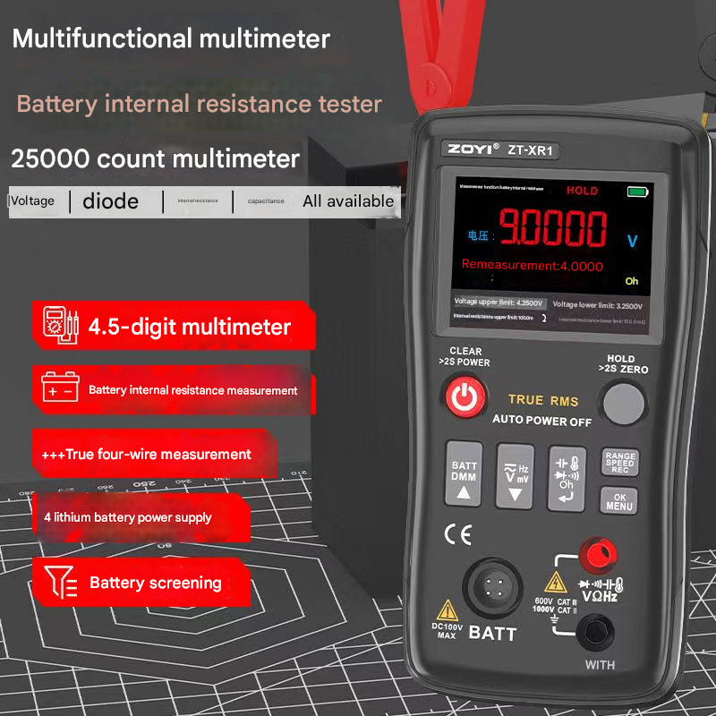
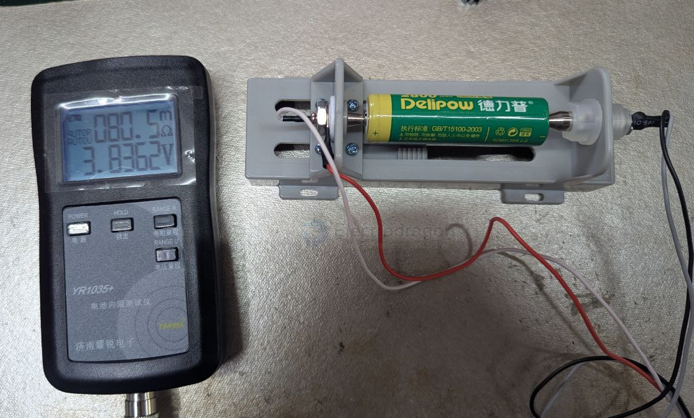
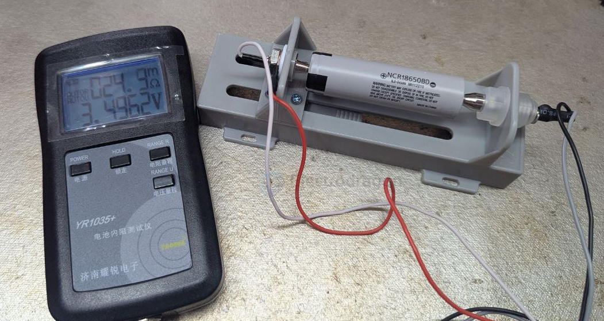

# internal-resistance-meter-dat

- [[internal-resistance-dat]] - [[resistor-dat]]

## Hioki Resistance Tester (Digital Low Resistance Tester / Micro-ohmmeter)

A professional instrument for precise measurement of low or high-precision resistance in electrical equipment.

**Features (sorted):**
- High precision: Measures resistance from milliohms to megaohms with minimal error
- Low resistance measurement: Accurate measurement of low resistance values (mΩ level) in motor windings, cables, contactors, and busbars
- Portability & recording: Some models are handheld, with data storage and interface for exporting measurement records
- Safety: Designed for live equipment or industrial environments; some models feature 4-wire (Kelvin) measurement

**Applications (sorted):**
- Contact resistance measurement in low-voltage distribution equipment
- Maintenance and inspection of industrial electrical equipment
- Motor winding testing
- Transformer wiring inspection

**English Names:**
- Digital Low Resistance Tester / Micro-ohmmeter
- Hioki Resistance Tester

## version plus with multimeter

- [[multimeter-dat]]

UT70A

## TS457

## ED1035 

testing - [[18650-dat]] 

80m ohm is really bad  

25m ohm is not bad  

## ref 

- [[battery-pack-dat]]

- [[internal-resistance-meter]]

- [[tools]]