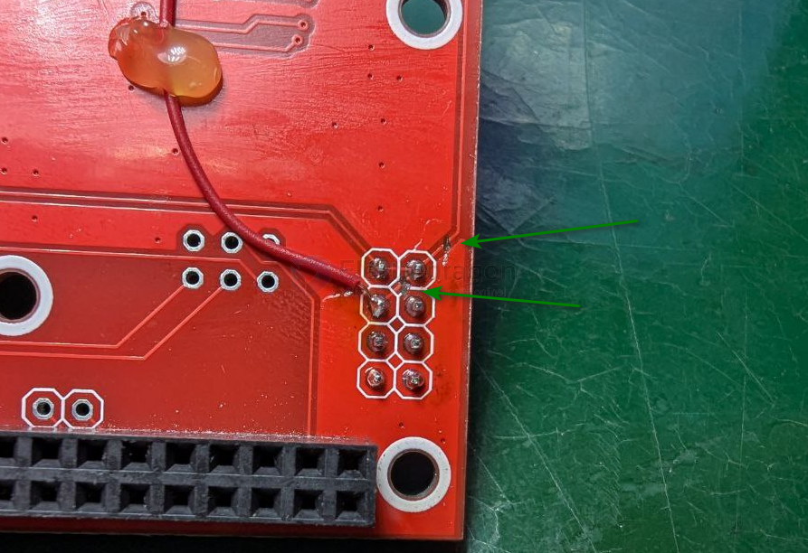

# tools-PCB-dat

## modification tools 

- cutting tools == [[PSO1060-dat]], shortly cutt the PCB trace

- mini drill bits == [[PTO1036-dat]], drill little holes to disconnect the PCB trace

## wires 

- [[flywire-dat]] - [[jumper-wire-dat]] - [[cable-dat]] - [[awg-wires-dat]]

## other tools 

- [[hot-gun-glue-dat]] - [[glue-dat]]

## cleaner 

- [[PCB-cleaner-dat]]

## soldering rack 

[Soldering Iron Wires Rack w/cleaning slots R2](https://www.electrodragon.com/product/casting-metal-soldering-rack/) - [[PSOS010-dat]]

## ref 

- [[tools-dat]]