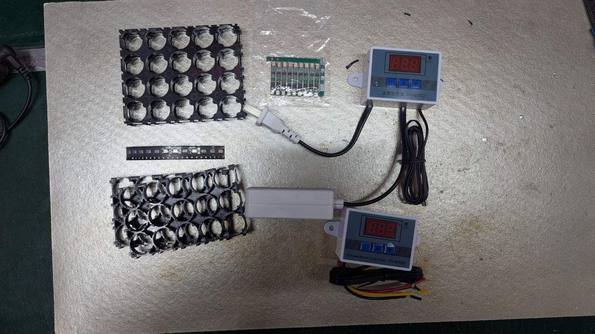

# week-4-8-dat

This a weekly update newsletter, to briefly tell you whats new and whats fun we are working at, hope you like

## New Boards

## Main Development 

Due to long yearly festival, holidays, and afterward heavy production work, this update was big delayed. 

We are going to buy a chinese community made openpnp build machine early this year, to boost our production capability, the cost of this machine is about 500 usd. 

In the meanwhile, we are also trying to build our own version openpnp pick and place machine by ourselves, lets see. A new PC graphic card is needed, the CAD file can be opened by browser APP onshape.com

The following documentation is still building, we are prbably going to build based on the machine version [[pixieplacer-dat]] - [[openpnp-dat]]

Find another opensource pick and place machine called lumenPNP, which is open source but also sell commerially - [[lumenpnp-dat]]

Order a few items from chinese seller, the total cost below is 7 usd. Includes: 

- singla 3.7V lithium battery protection board - [[BMS-dat]]
- [[18650-dat]] battery rack 3x5 pieces and 4x5 pieces 
- [[thermostat-dat]] control system
- [[MSM261S4030H0R-dat]] - simplly more sensors for our new prodcuts [[I2S-microphone]]

## Documents Updates

- add documentation for [[MPC1098-dat]], a board can do: Raspberry Pi GPIO IR RS232 Shield V2

- Batch programming for ESP8266 modules, use [[OPM1095-dat]] and [[DPR1120-dat]] - https://t.me/electrodragon3/331 - updated at page [[ESP8266-dat]]

- add knowledge how to use a p-mosfet to control power distribution (USB input, battery, etc) at page [[Power-distribution-dat]]

- add documentation and comparsion table for multimeter two models from victory: [[PTOS038-dat]]

- [[MQ-series-dat]] sensors datasheets added 

- pre-built [[SIMCOM-at-dat]] - [[SSCOM-dat]] commands list file, ready to use 

## Dissusion, Feedback, To-do

- [[OPM1095-dat]] V2 with voltage supervisor

- new comments add for board [[NWI1126-dat]], [url here](https://www.electrodragon.com/product/esp-led-strip-board/), this could be a [[mosfet-dat]] related problem. 

## Interesting Readings, News

- longevity for [[ESP8266-dat]] == [[espressif-dat]]

